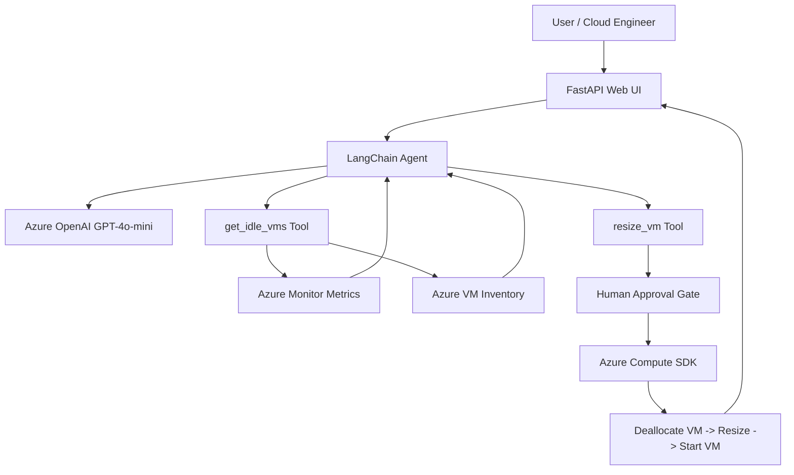

# Azure VM Cost Optimization Agent

An AI-powered Azure infrastructure assistant that detects idle Azure Virtual Machines, recommends right-sizing actions, and performs VM resize operations only after explicit human approval.

---

## Project Summary

This project demonstrates a real-world enterprise cloud automation use case:

> An AI agent analyzes Azure VM utilization, identifies idle VMs, suggests cost-saving resize actions, and executes the resize only after human approval.

The project is designed for Azure infrastructure, DevOps, FinOps, and Cloud Operations teams.

---

## Key Features

- Detects idle Azure VMs using Azure Monitor CPU metrics
- Calculates 7-day average CPU utilization
- Uses Azure OpenAI GPT-4o-mini with LangChain
- Uses custom LangChain tools for Azure operations
- Generates VM resize plans
- Shows current size, target size, estimated cost, and estimated savings
- Requires explicit approval before resizing
- Blocks resize approval from normal chat
- Uses a separate approval panel for safe execution
- Performs actual Azure VM resize using Azure SDK
- Deallocates VM, changes size, and starts VM again
- Provides a simple FastAPI web UI
- Includes Dockerfile for containerization
- Ready for GitHub Actions CI/CD

---

## Real-World Problem Solved

Cloud teams often run oversized or idle virtual machines, which increases monthly cloud cost.

Manual cost optimization usually requires:

- Checking Azure Monitor metrics
- Identifying idle VMs
- Comparing VM sizes
- Estimating savings
- Getting approval
- Manually resizing the VM

This project automates the workflow while keeping the final action under human control.

---

## Architecture



---

## Technology Stack

| Area | Technology |
|---|---|
| AI Model | Azure OpenAI GPT-4o-mini |
| Agent Framework | LangChain |
| Cloud Platform | Microsoft Azure |
| VM Operations | Azure Compute SDK |
| Monitoring | Azure Monitor Metrics |
| Web UI | FastAPI |
| Authentication | DefaultAzureCredential |
| Containerization | Docker |
| Registry | Azure Container Registry |
| CI/CD | GitHub Actions |
| Language | Python 3.12 |

---

## Project Structure

```text
azure-vm-cost-agent/
├── agent.py
├── app.py
├── tools.py
├── requirements.txt
├── Dockerfile
├── .dockerignore
├── .gitignore
├── .env.example
└── README.md
```

---

## File Details

| File | Purpose |
|---|---|
| `tools.py` | Contains Azure SDK logic and LangChain tools |
| `agent.py` | Creates the LangChain agent using Azure OpenAI |
| `app.py` | FastAPI web UI with chat and approval panel |
| `requirements.txt` | Python dependencies |
| `Dockerfile` | Container image definition |
| `.dockerignore` | Prevents secrets and unwanted files from entering Docker image |
| `.gitignore` | Prevents `.env` and cache files from being committed |
| `.env.example` | Safe example environment file |

---

## Environment Variables

Create a `.env` file in the project root.

```env
AZURE_OPENAI_ENDPOINT=https://your-resource.openai.azure.com/
AZURE_OPENAI_API_KEY=your_api_key_here
AZURE_OPENAI_DEPLOYMENT_NAME=gpt-4o-mini
```

Important:

```text
Never commit the real .env file to GitHub.
```

---

## Azure Resources Used

| Resource | Purpose |
|---|---|
| Azure VM | Target VM for analysis and resize |
| Azure Monitor | CPU metric collection |
| Azure OpenAI / Microsoft Foundry | GPT-4o-mini model deployment |
| Azure Container Registry | Container image registry |
| Azure Cloud Shell | Development and testing environment |

---

## Demo VM Used

| Property | Value |
|---|---|
| VM Name | `vm-runbook` |
| Resource Group | `rg-infra-lab` |
| Original Size | `Standard_D2s_v3` |
| Optimized Size | `Standard_D2lds_v5` |
| Resize Result | Successful |
| Approval Method | Human approval button |

---

## Completed Workflow

The project successfully performs this workflow:

```text
1. User asks agent to find idle VMs
2. Agent calls get_idle_vms tool
3. Tool checks Azure Monitor CPU metrics
4. Agent reports idle VMs
5. User requests resize plan
6. Agent/tool shows current size, target size, and estimated savings
7. User reviews the plan
8. User clicks Approve Resize in web UI
9. Tool deallocates the VM
10. Tool resizes the VM
11. Tool starts the VM again
12. User verifies the new VM size
```

---

## Example Agent Prompts

Find idle VMs:

```text
Find idle VMs
```

Show resize plan:

```text
Show resize plan for vm-runbook in rg-infra-lab to Standard_D2lds_v5
```

Resize approval is not accepted from chat. It must be done from the approval panel.

---

## Human Approval Safety Design

The project includes a safety gate to prevent accidental VM resize.

### Chat Approval Block

If the user types:

```text
yes
approve
confirm
proceed
```

The web UI blocks it and returns:

```text
Blocked: approval is not accepted in chat. Use the Approve Resize button.
```

### Approval Panel

Actual resize requires:

```text
Preview Resize -> Approve Resize
```

This separates AI recommendation from infrastructure execution.

---

## Local Setup

### 1. Clone the repository

```bash
git clone https://github.com/YOUR_USERNAME/azure-vm-cost-agent.git
cd azure-vm-cost-agent
```

### 2. Create `.env`

```bash
cp .env.example .env
nano .env
```

Update the values:

```env
AZURE_OPENAI_ENDPOINT=https://your-resource.openai.azure.com/
AZURE_OPENAI_API_KEY=your_api_key_here
AZURE_OPENAI_DEPLOYMENT_NAME=gpt-4o-mini
```

### 3. Install dependencies

```bash
python3 -m pip install --user -r requirements.txt
```

### 4. Login to Azure

```bash
az login
```

### 5. Run the app

```bash
python3 app.py
```

Open:

```text
http://localhost:7860
```

In Azure Cloud Shell:

```text
Web Preview -> Configure -> Port 7860 -> Open
```

---

## Docker Usage

Build the Docker image locally:

```bash
docker build -t azure-vm-cost-agent:v1 .
```

Run the container:

```bash
docker run -p 7860:7860 --env-file .env azure-vm-cost-agent:v1
```

Open:

```text
http://localhost:7860
```

Note:

```text
Do not copy secrets into the Docker image.
Use environment variables or managed identity in production.
```

---

## Azure Container Registry

An Azure Container Registry was created for this project.

Example:

```text
acrvmcost15858.azurecr.io
```

ACR remote build using `az acr build` may be blocked on free/trial subscriptions due to ACR Tasks restrictions.

Alternative approach:

```text
Use GitHub Actions to build the Docker image.
```

---

## GitHub Actions

A basic Docker build workflow can be added under:

```text
.github/workflows/docker-build.yml
```

Purpose:

```text
Build Docker image automatically when code is pushed to main branch.
```

---

## Security Notes

- `.env` is excluded using `.gitignore`
- `.env` is excluded from Docker image using `.dockerignore`
- API keys are not hardcoded
- Resize requires explicit human approval
- Chat approval is blocked
- Production version should use Managed Identity
- Production version should store secrets in Azure Key Vault
- RBAC should follow least privilege

---

## Skills Demonstrated

This project demonstrates:

- Azure VM administration
- Azure Monitor metrics usage
- Azure SDK automation
- LangChain agent development
- Azure OpenAI integration
- Human-in-the-loop automation
- FastAPI web application development
- Docker containerization
- GitHub repository management
- Cloud cost optimization workflow
- Enterprise-style infrastructure automation

---

## Business Value

This type of AI agent can help infrastructure teams:

- Reduce cloud waste
- Identify idle resources faster
- Standardize cost optimization decisions
- Reduce manual Azure portal checks
- Add approval-based automation
- Improve FinOps operations
- Lower operational effort for cloud support teams

---

## Future Enhancements

Planned improvements:

- Add memory and audit logs
- Store resize history in Azure Table Storage or Blob Storage
- Add email or Teams notification
- Add more metrics such as memory, disk, and network
- Add Azure Advisor recommendation integration
- Add authentication to the web UI
- Add deployment to Azure Container Apps
- Add Key Vault integration
- Add Managed Identity support
- Add GitHub Actions deployment pipeline

---

## Current Status

Completed:

- Azure OpenAI GPT-4o-mini deployment
- LangChain integration
- Idle VM detection tool
- VM resize tool
- Human approval safety gate
- FastAPI web UI
- Dockerfile
- Azure Container Registry creation
- Project folder cleanup

In progress:

- GitHub repository publishing
- GitHub Actions CI/CD
- Demo video and LinkedIn showcase

---

## Author

Saroj Khan

Azure Cloud & Infrastructure Engineer focused on Azure automation, AI agents, DevOps, and cloud cost optimization.
